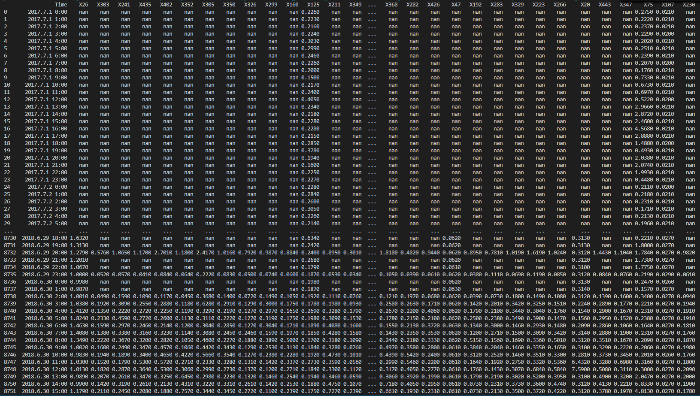
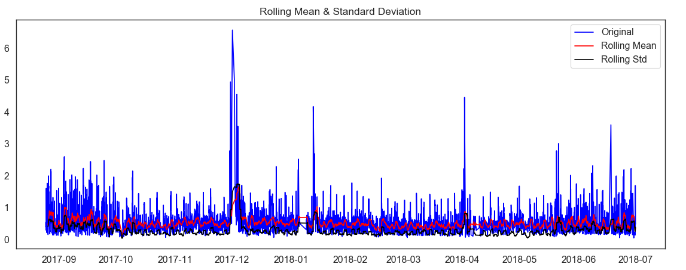
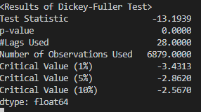

# Dacon-Energy
This repo is my try on a competition in https://dacon.io/cpt11
The point of the competition is to predict energy consumation for 200 families and I did **Time Series Analysis & Forecasting with LSTM** 


# Data
Download: https://drive.google.com/drive/folders/19BgB78WooPvEgOkBm65pufxi2DNvgQAp

train.csv
test.csv
submission_1002.csv

**train.csv**
1302 columns and 16909 rows with 1301 houses & 1 "Time" column
The time span of "Time" column is 2016-07-26 11:00:00 AM to 2018-06-30 11:00:00 PM
16909 rows exist in the data but only 3007~3010 data exist in every column or may even have none and the rest are filled with Nan.
There are also empty rows between data

**test.csv**
202 columns and 8760 rows with 201 houses & 1 "Time" column
The time span of "Time" column is 2017-07-1 00:00 to 2018-06-30 23:00
Like train.csv, many rows in the data has Nan but they at least have 1758 ~ 8761 rows

**submission_1002.csv**
This is the format they want of test.csv prediction.
It is filled with zeros. The goal of the competition is to minimize the score when submitted. When filled with zeros, the score is 200.

# Attempt
Dacon provides already made code sub_baseline.py which gives loss score of 41.41944.
I found out that it only trains on test data and fitted for every existing houses. I thought it was perfectly right way to do it.
So I analysed test.csv


This is the format of test.csv

```python
df=df_ori.loc[:,['Time',key]]
print(df)
df = df.dropna()
df['Time']=pd.to_datetime(df['Time']) 
df['year'] = df['Time'].apply(lambda x: x.year)
df['quarter'] = df['Time'].apply(lambda x: x.quarter)
df['month'] = df['Time'].apply(lambda x: x.month)
df['day'] = df['Time'].apply(lambda x: x.day)
df=df.loc[:,['Time',key, 'year','quarter','month','day']]
df.sort_values('Time', inplace=True, ascending=True)
df = df.reset_index(drop=True)

df["weekday"]=df.apply(lambda row: row["Time"].weekday(),axis=1)
df["weekday"] = (df["weekday"] < 5).astype(int)
```

With "Time", added "year", "quarter", "month", "day", "weekday" to analyze data

# Statistical Normality Test
Using **D’Agostino’s K² Test** to know if data is a Normal Distribution 
```python
stat, p = stats.normaltest(df.key)
print('Statistics=%.3f, p=%.3f' % (stat, p))
alpha = 0.05
if p > alpha:
    print('Data looks Gaussian (fail to reject H0)')
else:
    print('Data does not look Gaussian (reject H0)')
```


You can also calculate **Kurosis** and **Skewness** to calculate if the data is Normal Distribution

```python
sns.distplot(df[key]);
print( 'Kurtosis of normal distribution: {}'.format(stats.kurtosis(df[key])))
print( 'Skewness of normal distribution: {}'.format(stats.skew(df[key])))
```


In case of **Kurtosis**, it has value of 0 when Normal Distributed. If it is greater than zero, distribution has heavy tails and opposite on the other way

In case of **Skewness**, it has value between -0.5 and 0.5 when Normal Distributed.

# Yearly & Quarterly Energy Consumed
```python
plt.figure(figsize=(14,5))
plt.subplot(1,2,1)
plt.subplots_adjust(wspace=0.2)
sns.boxplot(x="year", y=key, data=df)
plt.xlabel('year')
plt.title('Box plot of Yearly Energy Consumed')
sns.despine(left=True)
plt.tight_layout()
plt.subplot(1,2,2)
sns.boxplot(x="quarter", y=key, data=df)
plt.xlabel('quarter')
plt.title('Box plot of Quarterly Energy Consumed')
sns.despine(left=True)
plt.tight_layout();
```


As we compare the output of each house, Yearly consumation generally dropped time to time while Quartely cosumation differed from house to house.

# Weekdays & Weekend
```python
dic={0:'Weekend',1:'Weekday'}
df['Day'] = df.weekday.map(dic)
    
plt1=sns.factorplot('year', key ,hue='Day', data=df, size=4, aspect=1.5, legend=False)                                                                                                                                                                                                                                                                                                                                             
plt.title('Factor Plot of Energy Consumation by Weekend/Weekday')                                                             
plt.tight_layout()                                                                                                                  
sns.despine(left=True, bottom=True) 
plt.legend(loc='upper right');

plt.show()
```


# Dickey-Fuller test
**Null Hypothesis(H0)**: It means that the time series has a unit root so is not stationary. It has some time dependent structure.

**Alternate Hypothesis(H1)**: It means that the time series doest not have a unit root so is stationary. It does not have time dependent structure.

p-value > **0.05**: Null Hypothesis
p-value <= **0.05**: Alternate Hypothesis


```python
df2=df1.resample('D', how=np.mean)

def test_stationarity(timeseries):
    rolmean = timeseries.rolling(window=30).mean()
    rolstd = timeseries.rolling(window=30).std()
    
    plt.figure(figsize=(14,5))
    sns.despine(left=True)
    orig = plt.plot(timeseries, color='blue',label='Original')
    mean = plt.plot(rolmean, color='red', label='Rolling Mean')
    std = plt.plot(rolstd, color='black', label = 'Rolling Std')

    plt.legend(loc='best'); plt.title('Rolling Mean & Standard Deviation')
    plt.show()
    
    print ('<Results of Dickey-Fuller Test>')
    dftest = adfuller(timeseries, autolag='AIC')
    dfoutput = pd.Series(dftest[0:4],
                        index=['Test Statistic','p-value','#Lags Used','Number of Observations Used'])
    for key,value in dftest[4].items():
        dfoutput['Critical Value (%s)'%key] = value
    print(dfoutput)

test_stationarity(df2[key].dropna())
```




As the above image shows, our data is stationary which makes predicting easier.

# Data Preprocess
First of all, the data seems to have a lot of Nan values and in some house, Nan values even outweight the true data. As Dacon provides a simple way to get rid of some of them. **The baseline checks if the value before Nan is greater than the total median of the column.**
If value > median, the value is divided by the number of the upcoming Nan and fill them. However, as mentioned in Dacon, we know that most of the times, Nan occurs when too much electricty are used. So why not upgrade them?

```python
def find_na(data, limit=0):
    counting= data.loc[ data.isnull()==False].index

    df=DataFrame( list( zip( counting[:-1], counting[1:] - counting[:-1] -1  ) ), columns=['index','count'] )

    df2= df[ (df['count'] > limit) ] #결측치가 존재하는 부분만 추출
    df2=df2.reset_index(drop=True) #기존에 존재하는 index를 초기화 하여 이후 for문에 사용함

    return df2

def overloaded_na_handle(data):
    data_cp = data.copy()

    for k in range(1, len(data_cp.columns) ): #시간을 제외한 1열부터 마지막 열까지를 for문으로 작동시킵니다.
        test_median= data_cp.iloc[:,k].median() #값을 대체하는 과정에서 값이 변경 될 것을 대비해 해당 세대의 중앙값을 미리 계산하고 시작합니다.
        counting= data_cp.loc[ data_cp.iloc[:,k].isnull() == False ][ data_cp.columns[k] ].index

        df=DataFrame( list( zip( counting[:-1], counting[1:] - counting[:-1] -1  ) ), columns=['index','count'] )

        df2= df[ (df['count'] > 0) ] #결측치가 존재하는 부분만 추출
        df2=df2.reset_index(drop=True) #기존에 존재하는 index를 초기화 하여 이후 for문에 사용함

        for i,j in zip( df2['index'], df2['count'] ) : # i = 해당 세대에서 값이 존재하는 index, j = 현재 index 밑의 결측치 갯수

            if data_cp.iloc[i,k]>=test_median: #현재 index에 존재하는 값이 해당 세대의 중앙 값 이상일때만 분산처리 실행
                data_cp.iloc[ i + 1 : i+j+1 , k] = data_cp.iloc[i,k] / (j+1) 
                #현재 index 및 결측치의 갯수 만큼 지정을 하여, 현재 index에 있는 값을 해당 갯수만큼 나누어 줍니다
            else:  
                pass #현재 index에 존재하는 값이 중앙 값 미만이면 pass를 실행
        if k%50==0: #for문 진행정도 확인용
                print(k,"번째 실행중")

    return data_cp

```
overloaded_na_handle() 
If value > median, the value is divided by the number of the upcoming Nan and fill them like the baseline **but the value before Na doesn't change**

```python
def fbfill_nan(data):
    data_cp = data.copy()
    data_cp = data_cp.fillna(method='ffill', limit= 1)
    return data_cp
```
This function fills one na by copying the data above. Used this function because there is many single Na present in the data.


```python
def drop_notfullday(data):
    data_cp = data.copy()
    for k in range(1, len(data_cp.columns) ): #시간을 제외한 1열부터 마지막 열까지를 for문으로 작동시킵니다.
        house = data.cp.iloc[:, k]
        nan_info_df = find_na(house, limit=0)

        for i,j in zip( nan_info_df['index'], nan_info_df['count'] ) : # i = 해당 세대에서 값이 존재하는 index, j = 현재 index 밑의 결측치 갯수
            start_index = i + 1
            end_index = i + j
            
            start_index = start_index - (start_index % 24)
            end_index = end_index + (24 -(end_index % 24))
            data_cp.iloc[start_index : end_index, k] = None

    return data_cp
```
Drop a whole day which doesn't have 24 hours of data


```python
def drop_na(data, limit= 24):

    ########### 첫번째 데이터까지의 nan 값들 제거
    counting = data.loc[ data.isnull()==False].index
    first_data_idx = counting[0]
    end_index = first_data_idx + (24 -(first_data_idx % 24))
    # data.iloc[counting[0] : end_index, k] = None

    index_list = np.arange(0, end_index)

    data = data.drop(index_list)

    df=DataFrame( list( zip( counting[:-1], counting[1:] - counting[:-1] -1  ) ), columns=['index','count'] )

    df2= df[ (df['count'] > limit) ] #결측치가 존재하는 부분만 추출
    df2=df2.reset_index(drop=True) #기존에 존재하는 index를 초기화 하여 이후 for문에 사용함

    for i,j in zip( df2['index'], df2['count'] ) : # i = 해당 세대에서 값이 존재하는 index, j = 현재 index 밑의 결측치 갯수
        i += 1
        index_list = np.arange(i, i + j)
        data = data.drop(index_list)

    return data

```
Drop na values over one day so that when making our train dataset, it makes easier

These were the way to get rid of Na values

Now, what we should do to train our model is to
**- change data shape to make LSTM easier to learn**
**- normalize and scale data**

Since the data is not normal distributed, we will use MinMaxScaler()

```python
def split(data, x_size, y_size, gap=1, debug=False):

    x = []; y = []; batch = []

    index = int((len(data) - x_size - y_size) / gap) + 1

    for i in range(index):
        batch = data[i * gap : i * gap + x_size + y_size]
        if debug:
            print(batch, '\n')
            print(batch.shape)
        if np.isnan(batch).any():
            continue
        
        x.append(batch[0:x_size])
        y.append(batch[-y_size:])

    pred_data = data[len(data) - x_size: ]
    pred_data = pred_data.reshape(-1, pred_data.shape[0])

    return np.array(x), np.array(y), pred_data
```
Split the data to match LSTM 


# Model
```python
def build_model():

    #### LSTM
    model = Sequential()
    model.add(LSTM(100, return_sequences=False, input_shape=(x_shape, 1)))
    model.add(Dropout(0.25))
    model.add(Dense(y_shape, activation='linear'))

model = build_model()
model.compile(optimizer='adam', loss='mse')

early_stopping = EarlyStopping(monitor='val_loss', patience=5, mode='auto')
model.fit(x_train, y_train, batch_size=512, epochs=2, callbacks=[early_stopping], validation_data=(x_test, y_test), verbose= 0)
loss = model.evaluate(x_test, y_test, verbose= 0)
```
