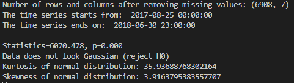
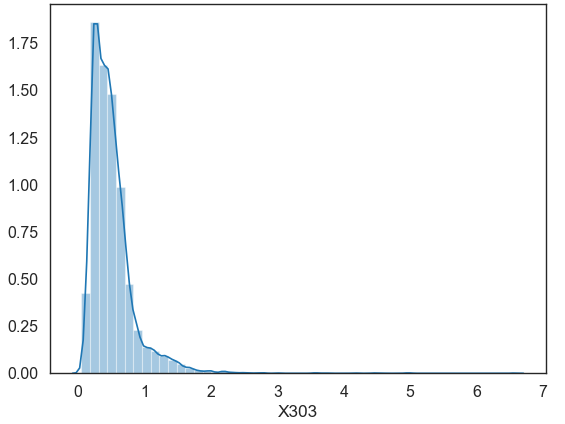
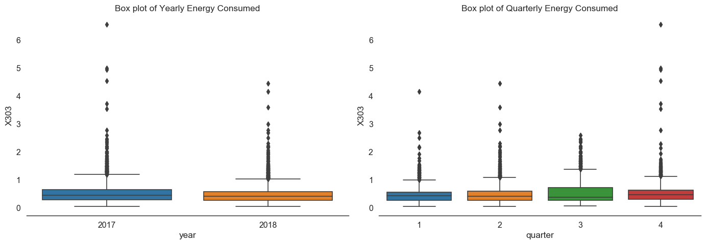
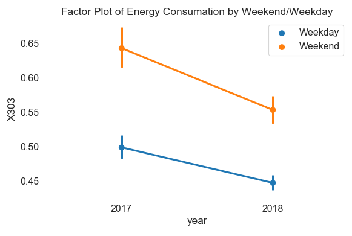

# Dacon-Energy
Dacon is a **data competition website** like kaggle for example. 
This repo is my attempt on **Time Series Analysis & Forecasting with LSTM**. The point of the competition is to predict energy consumation for 200 families.
Competition website: https://dacon.io/cpt11


# Data
Download: https://drive.google.com/drive/folders/19BgB78WooPvEgOkBm65pufxi2DNvgQAp

train.csv
test.csv
submission_1002.csv

**train.csv**
1302 columns and 16909 rows with 1301 houses & 1 "Time" column
The time span of "Time" column is 2016-07-26 11:00:00 AM to 2018-06-30 11:00:00 PM
16909 rows exist in the data but only 3007~3010 data exist in every column or may even have none and the rest are filled with Nan.
There are also empty rows between data

**test.csv**
202 columns and 8760 rows with 201 houses & 1 "Time" column
The time span of "Time" column is 2017-07-1 00:00 to 2018-06-30 23:00
Like train.csv, many rows in the data has Nan but they at least have 1758 ~ 8761 rows

**submission_1002.csv**
This is the format they want of test.csv prediction.
It is filled with zeros. The goal of the competition is to minimize the score when submitted. When filled with zeros, the score is 200.

# Attempt
Dacon provides already made code sub_baseline.py which gives loss score of 41.41944.
I found out that it only trains on test data and fitted for every existing houses. I thought it was perfectly right way to do it.
So I analysed test.csv


This is the format of test.csv

```python
df=df_ori.loc[:,['Time',key]]
print(df)
df = df.dropna()
df['Time']=pd.to_datetime(df['Time']) 
df['year'] = df['Time'].apply(lambda x: x.year)
df['quarter'] = df['Time'].apply(lambda x: x.quarter)
df['month'] = df['Time'].apply(lambda x: x.month)
df['day'] = df['Time'].apply(lambda x: x.day)
df=df.loc[:,['Time',key, 'year','quarter','month','day']]
df.sort_values('Time', inplace=True, ascending=True)
df = df.reset_index(drop=True)

df["weekday"]=df.apply(lambda row: row["Time"].weekday(),axis=1)
df["weekday"] = (df["weekday"] < 5).astype(int)
```

With "Time", added "year", "quarter", "month", "day", "weekday" to analyze data

# Statistical Normality Test
Using **D’Agostino’s K² Test** to know if data is a Normal Distribution 
```python
stat, p = stats.normaltest(df.key)
print('Statistics=%.3f, p=%.3f' % (stat, p))
alpha = 0.05
if p > alpha:
    print('Data looks Gaussian (fail to reject H0)')
else:
    print('Data does not look Gaussian (reject H0)')
```


You can also calculate **Kurosis** and **Skewness** to calculate if the data is Normal Distribution

```python
sns.distplot(df[key]);
print( 'Kurtosis of normal distribution: {}'.format(stats.kurtosis(df[key])))
print( 'Skewness of normal distribution: {}'.format(stats.skew(df[key])))
```




In case of **Kurtosis**, it has value of 0 when Normal Distributed. If it is greater than zero, distribution has heavy tails and opposite on the other way

In case of **Skewness**, it has value between -0.5 and 0.5 when Normal Distributed.

```python
plt.figure(figsize=(14,5))
plt.subplot(1,2,1)
plt.subplots_adjust(wspace=0.2)
sns.boxplot(x="year", y=key, data=df)
plt.xlabel('year')
plt.title('Box plot of Yearly Energy Consumed')
sns.despine(left=True)
plt.tight_layout()
plt.subplot(1,2,2)
sns.boxplot(x="quarter", y=key, data=df)
plt.xlabel('quarter')
plt.title('Box plot of Quarterly Energy Consumed')
sns.despine(left=True)
plt.tight_layout();
```


As we compare the output of each house, Yearly consumation generally dropped time to time while Quartely cosumation differed from house to house.


```python
dic={0:'Weekend',1:'Weekday'}
df['Day'] = df.weekday.map(dic)
    
plt1=sns.factorplot('year', key ,hue='Day', data=df, size=4, aspect=1.5, legend=False)                                                                                                                                                                                                                                                                                                                                             
plt.title('Factor Plot of Energy Consumation by Weekend/Weekday')                                                             
plt.tight_layout()                                                                                                                  
sns.despine(left=True, bottom=True) 
plt.legend(loc='upper right');

plt.show()
```

